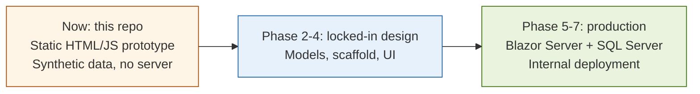

# Monthly Cost Report — Frontend Prototype

A standalone HTML/CSS/JS prototype that demonstrates the UX, layout, and business logic for a monthly cost-report data-entry tool, intended to replace a legacy Power Apps Canvas App. All sample data shown is synthetic; the prototype is not tied to any real database or organization.

---

## At a glance



---

## What it does

- Project selector + month selector
- Read-only financial figures sourced from a (mocked) reporting view
- Three **independently saveable** fields:
  - `TargetAmount` (monthly income)
  - `AmtDesc` (cost/income notes, HTML rich text)
  - `SolDesc` (warnings & actions, HTML rich text)
- Live recalculation: `cumulative income = previous month AccRealAmt + this month TargetAmount`
- Per-field unsaved indicator and toast on save
- Read-only payment list per project/month
- Floating dev panel that explains the calculation in real time

## How to run

Open `prototype/index.html` directly in any modern browser. No build step, no server, no Node required.

```
prototype/
  index.html       — entry page
  style.css        — flat, form-style UI
  app.js           — state, calculation, save handlers
  mock-data.js     — 10 synthetic projects × 12 months × ~110 payments
docs/
  ARCHITECTURE.md  — system diagrams (mermaid)
  TECH-STACK.md    — current + target stacks
  BUSINESS-LOGIC.md — cumulative income formula
  ROADMAP.md       — 8-phase plan
CHANGELOG.md
LICENSE
```

## Tech stack (TL;DR)

- **Now (prototype):** HTML5 + CSS3 + vanilla JavaScript (ES2017+), no build, no Node, no server.
- **Target (production):** Blazor Server (.NET 8 LTS) + EF Core / Dapper + SQL Server + Windows Auth or Azure AD, single Visual Studio solution deployed to IIS on the internal network.

See [docs/TECH-STACK.md](docs/TECH-STACK.md) for the full table and reasoning.

## Architecture

See [docs/ARCHITECTURE.md](docs/ARCHITECTURE.md) — includes mermaid diagrams for:
- Current prototype system map
- Target Blazor Server architecture
- Read flow (parallel queries)
- Write flow (per-field UPSERT)
- Month-lifecycle state machine
- Component diagram
- Entity-relationship diagram
- Phase roadmap

## Business logic

The most important rule: see [docs/BUSINESS-LOGIC.md](docs/BUSINESS-LOGIC.md).

```
cumulative_income_displayed
    = previous_month.AccRealAmt          (read from ProjectMonthlySummary)
    + this_month.TargetAmount             (user input, stored in MonthlyReportDesc)
```

This is computed in the application layer, **never persisted as a column**.

## Status

- [x] Layout & UX aligned with legacy app
- [x] Three independent save buttons (per editable field)
- [x] Live cumulative recalculation
- [x] Mermaid-rendered architecture documentation
- [ ] Real DB integration (blocked on backend write-target table being created)
- [ ] Blazor Server migration (blocked on local .NET SDK availability)

## License

MIT. See [LICENSE](LICENSE).
