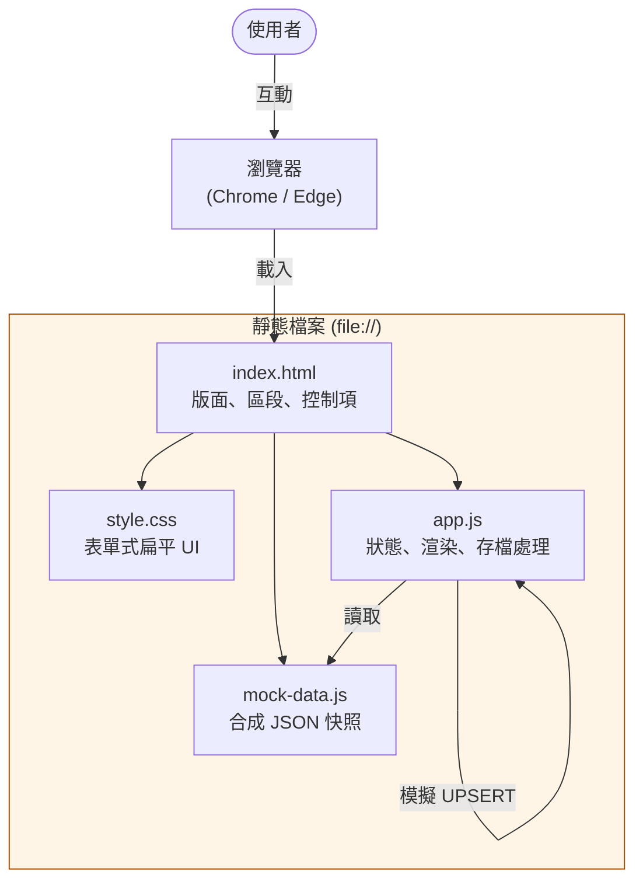
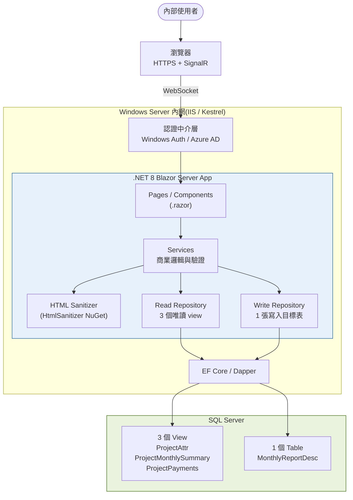
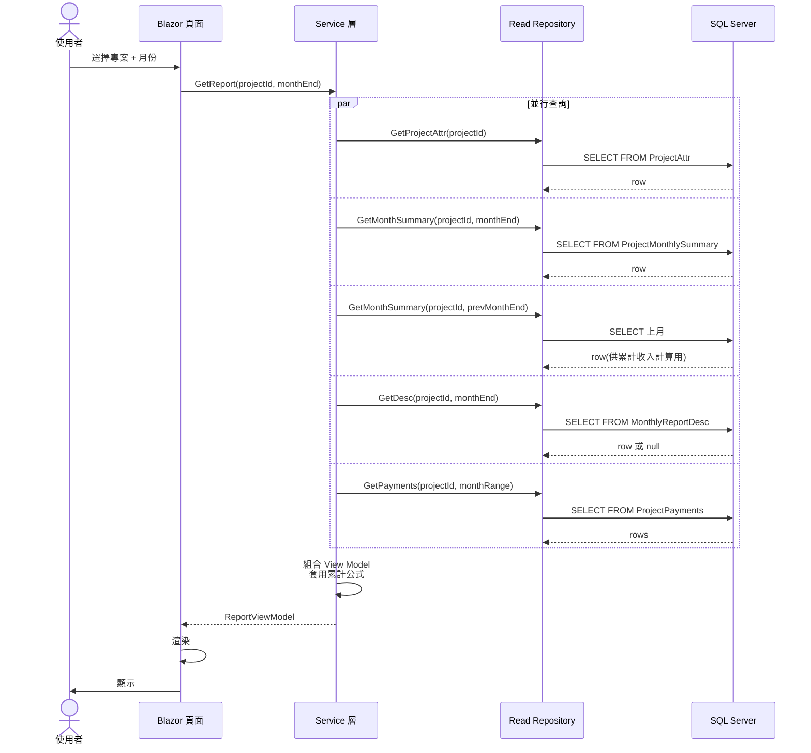
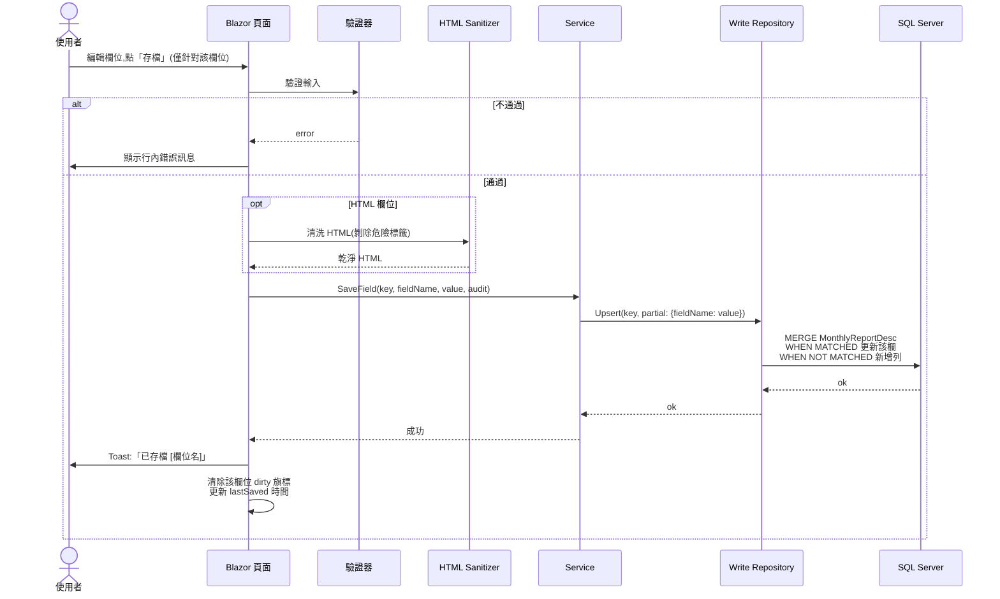
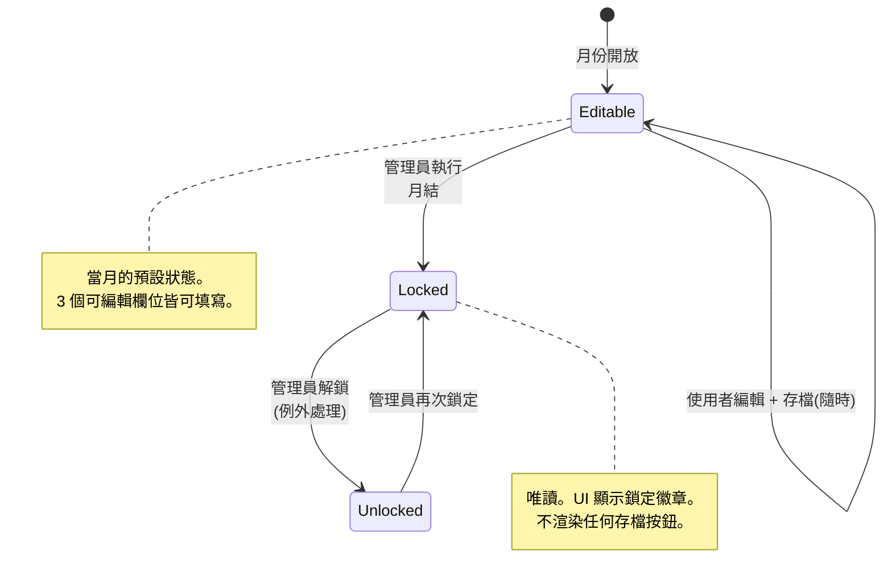
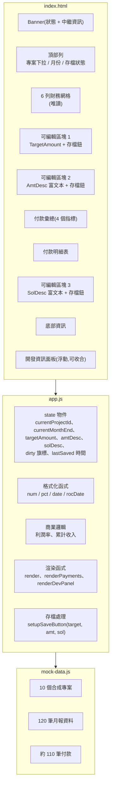
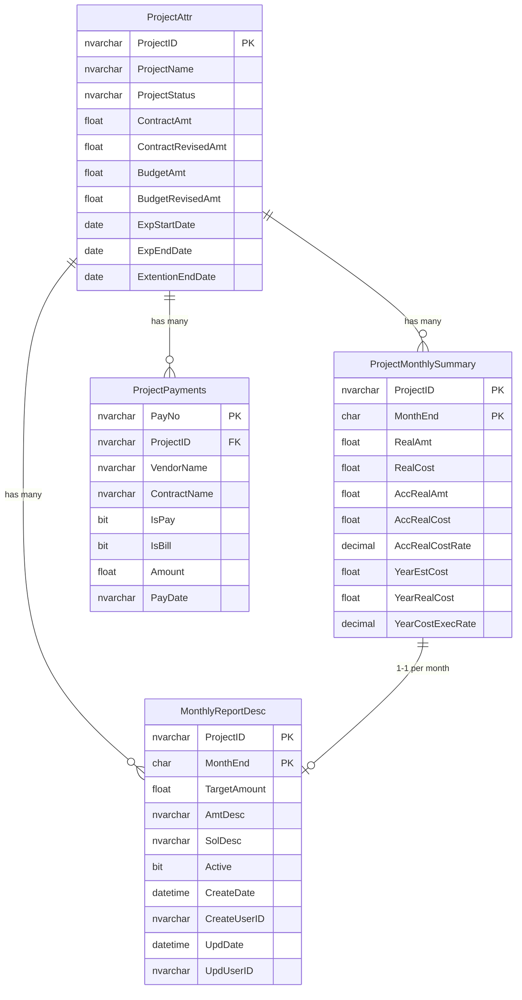
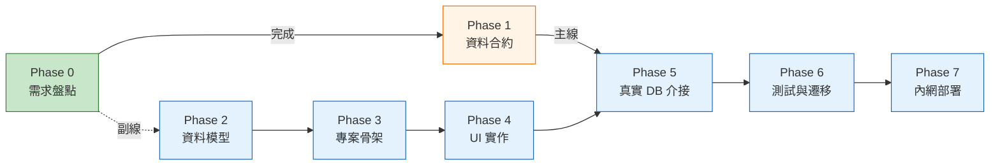

# 系統架構

本文件描述月報成本控制系統的完整架構,包含 **當前原型**(靜態 HTML/JS)與 **目標正式版**(Blazor Server)。

---

## 1. 系統架構 — 當前原型 (v0.2)

原型完全在瀏覽器內執行。沒有伺服器、沒有建置步驟、沒有網路呼叫。

**特性:**
- 單一資料夾部署 — 複製整個資料夾即可
- 不做持久化 — 重新整理就清空(原型刻意如此)
- 儲存為模擬,寫到 `console.log`

---

## 2. 系統架構 — 目標正式版 (Blazor Server)

**為什麼選 Blazor Server 而非 SPA:**
- 不需要 JavaScript 建置工具鏈(不需 Node、不需 npm)
- 端到端 C#(單一語言,單一團隊可維護)
- 原生整合 Windows Auth / Azure AD
- 內網部署,SignalR 延遲忽略不計
- 單一 .NET 專案編譯、單一部署單位

---

## 3. 讀取流程(序列圖)

---

## 4. 寫入流程(序列圖)— 每個欄位獨立存檔

每個可編輯欄位都有自己的存檔按鈕。每次存檔是獨立的「部分 UPSERT」。

---

## 5. 月份生命週期(狀態機)

---

## 6. 元件圖 — 當前原型

---

## 7. 資料模型(命名刻意通用化)

### 唯讀 view(DB 既有)

| View | Key | 用途 |
|---|---|---|
| `ProjectAttr` | `ProjectID` | 專案屬性、合約與預算金額、日期 |
| `ProjectMonthlySummary` | `ProjectID` + `MonthEnd` | 當月財務彙總、累計值 |
| `ProjectPayments` | `PayNo` | 付款明細(以 `ProjectID` 關聯) |

### 寫入目標(待建)

| Table | Key | 欄位 |
|---|---|---|
| `MonthlyReportDesc` | `ProjectID` + `MonthEnd` | `TargetAmount` (float)、`AmtDesc` (HTML)、`SolDesc` (HTML),加上稽核欄位 |

### 實體關聯

---

## 8. 階段路線圖

**主線**(Phase 1 → 5 → 6 → 7)是關鍵路徑,依賴後端就緒。**副線**(Phase 2 → 3 → 4)可用 Mock 資料平行進行,目前的原型就是副線的階段性產出。

---

## 9. 資安邊界

- 連線字串、帳密、權杖只存在於伺服器,**絕不**出現在瀏覽器。
- HTML 富文本欄位在伺服器端統一過 sanitizer,白名單允許 `b`、`i`、`u`、`p`、`ul`、`ol`、`li`、`a`、`br`。
- 所有寫入動作含稽核欄位(`CreateUserID`、`UpdUserID`),由 SSO 身分自動填入。
- 列級存取控制:Read Repository 依使用者部門或指派清單過濾專案(透過 `IsActiveAssignee(userId, projectId)` 判定式)。
