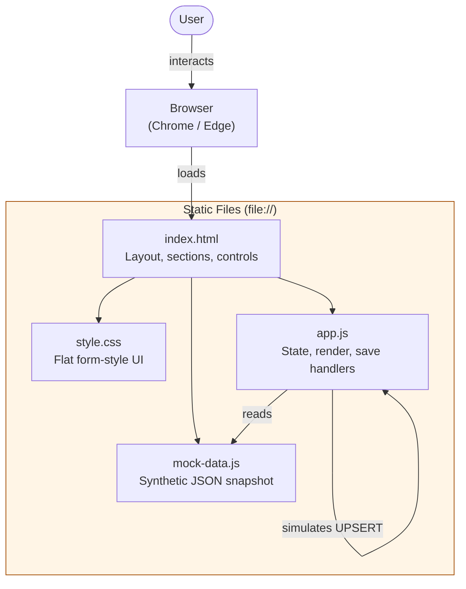
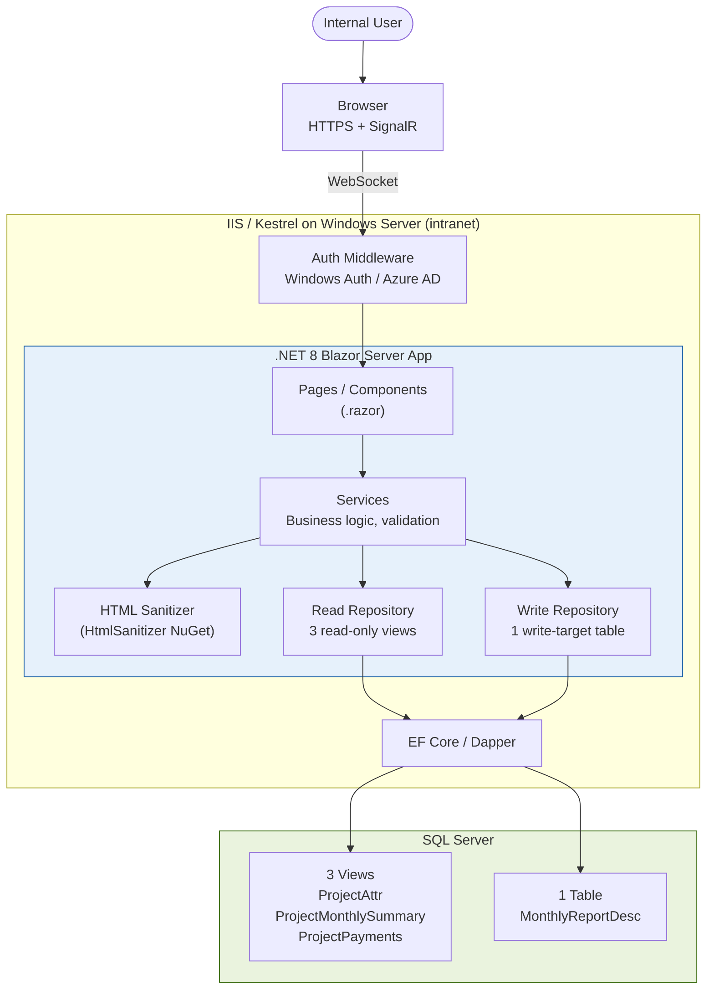
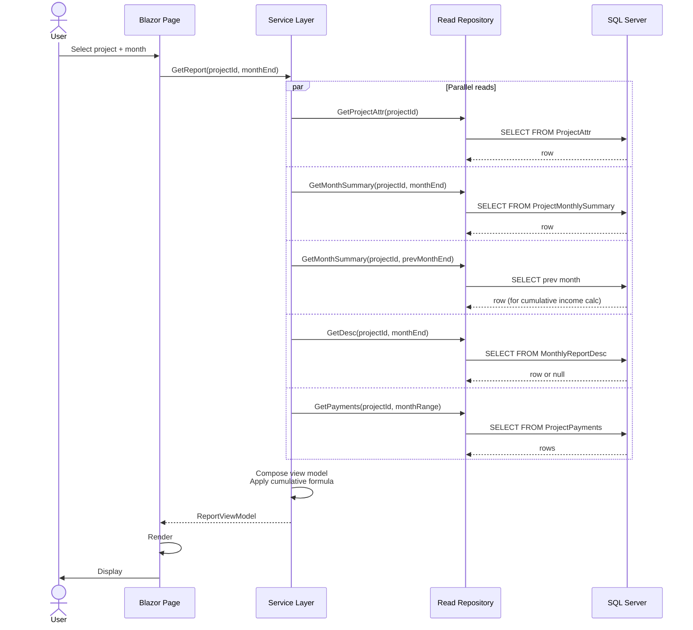
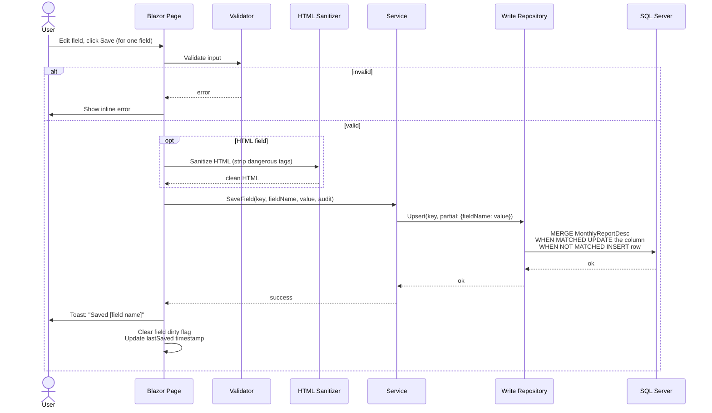
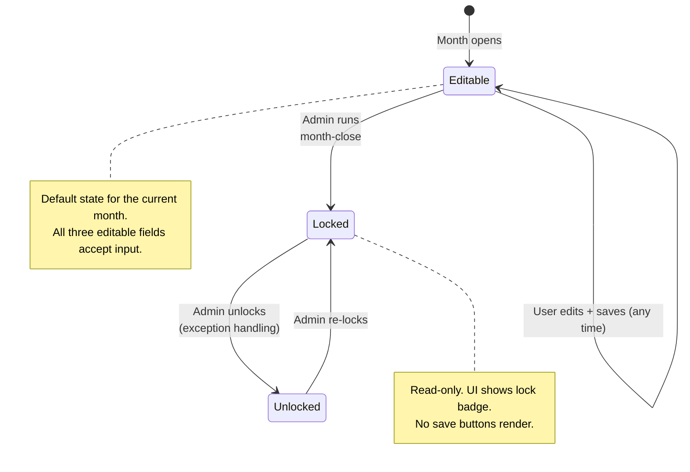
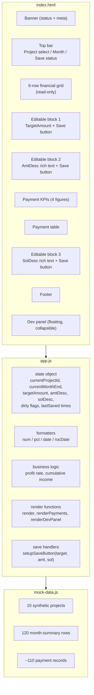
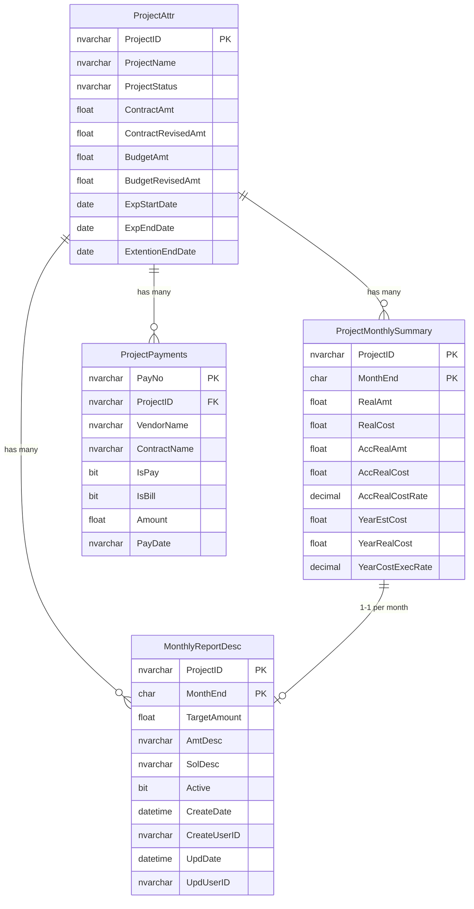
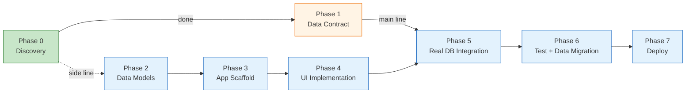

# Architecture

This document describes the complete architecture of the Monthly Cost Report system, both the **current prototype** (static HTML/JS) and the **target production architecture** (Blazor Server).

---

## 1. System Architecture — Current Prototype (v0.2)

The prototype runs entirely in the browser. No server, no build step, no network calls.

**Key characteristics:**
- Single-file deployment — just copy the folder
- No persistence — refresh clears edits (intentional for prototype)
- Save is simulated and logged to `console.log`

---

## 2. System Architecture — Target Production (Blazor Server)

**Why Blazor Server over a SPA:**
- No JavaScript build toolchain needed (no Node, no npm)
- End-to-end C# (single language, one team can maintain)
- Native Windows Auth / Azure AD integration
- Intranet deployment makes SignalR latency a non-issue
- A single .NET project compiles & deploys as one unit

---

## 3. Read Flow (sequence)

---

## 4. Write Flow (sequence) — Per-field Save

Each editable field has its own save button. Each save is an independent partial UPSERT.

---

## 5. State Machine — Month Lifecycle

---

## 6. Component Diagram — Current Prototype

---

## 7. Data Model (intent — names are deliberately generic)

### Read-only views (existing in DB)

| View | Key | Purpose |
|---|---|---|
| `ProjectAttr` | `ProjectID` | Project metadata, contract & budget amounts, dates |
| `ProjectMonthlySummary` | `ProjectID` + `MonthEnd` | Per-month financial summary, cumulative roll-ups |
| `ProjectPayments` | `PayNo` | Payment line items (joined by `ProjectID`) |

### Write target (to be created)

| Table | Key | Columns |
|---|---|---|
| `MonthlyReportDesc` | `ProjectID` + `MonthEnd` | `TargetAmount` (float), `AmtDesc` (HTML), `SolDesc` (HTML), plus audit columns |

### Entity-relationship

---

## 8. Phase Roadmap

The **main line** (Phase 1 → 5 → 6 → 7) is the critical path and depends on backend readiness. The **side line** (Phase 2 → 3 → 4) can proceed in parallel using mock data — this is what the current prototype represents.

---

## 9. Security Boundaries

- Connection strings, credentials, and tokens live **only** on the server, never in the browser.
- HTML rich-text fields are sanitized server-side before insert/update — a whitelist of formatting tags (`b`, `i`, `u`, `p`, `ul`, `ol`, `li`, `a`, `br`).
- All write operations include audit metadata (`CreateUserID`, `UpdUserID`) populated from the authenticated SSO identity.
- Row-level access control: the read repository filters projects by the user's department or assignment list (driven by an `IsActiveAssignee(userId, projectId)` predicate).
